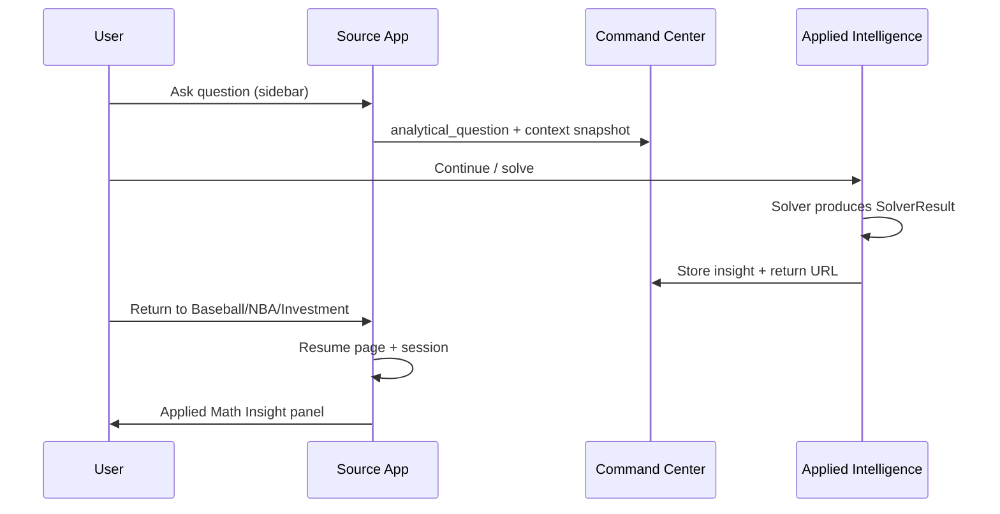

# Applied Math P2 — Return Insight to Source App

**Last updated:** 2026-06-06  
**Status:** Design / not implemented  
**Branch target:** `dev` in each repo

## Problem

After Applied Mathematical Intelligence (AMI) solves a question, users must manually navigate back to Baseball, NBA, or Investment and re-find their page context. They lose the mathematical conclusion unless they stay in AMI.

## Goal

Add **Return to {Source App}** from AMI that:

1. Restores the **exact page and session context** that generated the question (filters, selections, chart state).
2. Displays an **Applied Math Insight** panel beside existing analysis — display-only in V1.
3. Does **not** reset app state, rebuild draft boards, or auto-modify rankings/projections/scores.

## V1 Guardrails

- **Display only:** insight panel shows conclusion, method, assumptions, confidence, link to full AMI analysis.
- **No auto-writes** to rankings, projections, portfolio scores, probabilities, or draft values.
- **No full app reset** — use existing resume/deep-link + session restore patterns.

## Architecture

### Payload contract (`applied_math_insight`)

Stored in session + optional Supabase activity blob when AMI completes a solve:

```json
{
  "insight_id": "sha256…",
  "question_id": "matches analytical_question.question_id",
  "source_app": "baseball | nba | investment",
  "source_page": "Trend Value | Comparison Tool | …",
  "conclusion": "short headline",
  "method": "rule-based trend regression | stat-gap chase | rebalance drift",
  "assumptions": ["3-season window", "linear slope"],
  "confidence": "high | medium | low",
  "key_numbers": {"slope": 0.012, "r2": 0.78},
  "full_analysis_url": "Command Center → AMI resume URL",
  "created_at": "ISO8601"
}
```

### Session keys (source app)

| Key | Purpose |
|-----|---------|
| `_ami_pending_insight` | Insight waiting to render on return |
| `_ami_return_page` | Page to activate on return |
| `_ami_return_context` | Minimal restore hints (player IDs, tab, filters) |

### Flow



### Shared modules to extend

| Module | Change |
|--------|--------|
| `suite_analytical_question.py` | Add `build_return_insight_payload()`, `ami_return_url()` |
| `suite_deep_links.py` | `?ami_insight={id}&resume_page=…` query params |
| `suite_resume_launch.py` | Restore page + attach pending insight |
| AMI `applied_math_solver_ui.py` | "Return to {app}" button after solve |
| Source `streamlit_app.py` | Per-page `render_applied_math_insight_panel()` hook |

### Per-app render hooks

| App | Page | Restore | Insight placement |
|-----|------|---------|-------------------|
| Baseball | Comparison Tool | `sig_player_a/b`, comparison table | Below comparison summary |
| Baseball | Trend Value | filters, single/multi player, chart stat | Below Insight Summary |
| Baseball | Historical Explorer | year range, sort stat, selected player | Below table/chart |
| Baseball | Draft Assistant | draft queue, round/pick | Sidebar or panel above board |
| NBA | Legacy Tracker | selected player, stat target | Below tracker table |
| NBA | Live Game Center | team, opponent, win prob | Below live metrics |
| Investment | Portfolio Health | holdings, health result | Above rebalance recommendations |

### UI component (V1)

```python
def render_applied_math_insight_panel(st, insight: dict) -> None:
    """Collapsible card — conclusion, method, assumptions, confidence, link."""
```

Style: match existing coach/success panels; dismissible; persists until user clears or new insight.

## Implementation phases

### Phase 1 — Plumbing (1 PR, command center + AMI)

- [ ] Define `AppliedMathInsight` dataclass / JSON schema
- [ ] AMI: on solve complete, write insight to session + activity
- [ ] AMI: "Return to Baseball/NBA/Investment" button with deep link
- [ ] `suite_deep_links`: parse `ami_insight` param on source app load

### Phase 2 — Baseball (1 PR)

- [ ] `render_applied_math_insight_panel` in baseball-stat-app
- [ ] Hooks on Comparison, Trend, Historical, Draft pages
- [ ] Tests: insight renders, no state mutation

### Phase 3 — NBA + Investment (1 PR each)

- [ ] Legacy Tracker + Live GC (NBA)
- [ ] Portfolio Health / Macro (Investment)

### Phase 4 — Polish

- [ ] Command Center card shows "Insight ready — return to source"
- [ ] Developer Mode: insight payload debug panel

## Testing

- Unit: payload round-trip, URL builder, panel render with mock insight
- Integration: send question → solve in AMI → return → same players selected + insight visible
- Regression: draft board unchanged, rankings unchanged after return

## Related fixes (P1, shipped separately)

- Context refresh at Send click (`build_submit_context`) — reduces "missing data" in AMI
- Baseball trend projection numbers in Insight Summary
- NBA `live_win_prob_display` persistence
- Investment rebalance drift backfill on cached health

## Notes

- Reuse existing `suite_resume_launch` and page filter save/restore in Baseball (`save_page_state`).
- Do not duplicate full AMI analysis in source app — link back for details.
- Future P3: optional "Apply insight" actions (explicit user confirm only).
