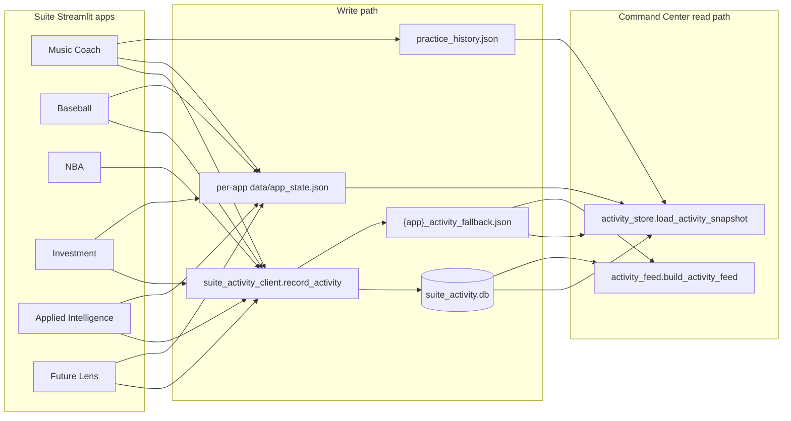

# Cross-app activity tracking audit

**Date:** 2026-06-01  
**Command Center build:** see `app_urls.BUILD_VERSION`

## How data flows

### Streamlit Cloud limitation (important)

Each app runs in an **isolated container** with its own filesystem.

| Mechanism | Works locally (sibling repos) | Works on Streamlit Cloud |
|-----------|------------------------------|---------------------------|
| Shared `daniel-ai-command-center/data/suite_activity.db` | Yes, if apps find CC via `suite_activity_client` path candidates | **No** — each deployment has its own disk |
| Per-app `data/app_state.json` | Yes, read by CC when repos are side-by-side | **No** — CC cannot read another app’s container |
| `practice_history.json` (music) | Yes, when file exists on shared machine | **No** — unless music app writes to external store |
| Per-app `*_activity_fallback.json` | Written when SQLite unavailable | Stays **inside that app’s** container only |
| Resume items / events in CC SQLite | Yes on one machine | Only events recorded **from the Command Center process** |

**Bottom line:** Full cross-app dashboard sync on Streamlit Cloud requires a **cloud backend** (Supabase, Firebase, S3 + API, etc.). `suite_storage.py` is designed so the public API can be swapped without changing app call sites.

**Current best fallback on Cloud:** each app logs to its local fallback JSON + local `app_state.json`; Command Center shows whatever was written into **its own** DB when the CC app itself records events, plus any data you manually sync. Local dev with repos in `~/Documents/GitHub/*` gets the full experience.

---

## Per-app audit

### Music Practice Coach (`ai-music-practice-coach`)

| Item | Status |
|------|--------|
| **Hooks today** | `song_selected` (song picker), `practice` (practice log save), `save_local_app_state` on persist |
| **Metrics saved** | `song`, `artist`, `genre`, `pick_key`, `focus`, `minutes`; local state: `instrument`, `display_key`, `practice_focus_section`, `studio_page` |
| **Resume cards** | `Continue: {title}` per song |
| **CC reads** | SQLite events, `practice_history.json`, `data/app_state.json` |
| **CC shows** | App Directory: last song, instrument, streak; Feed: practice / song opened; Weekly: minutes, songs |
| **Still needs hooks** | `chord_save`, `chart_save`, `backing_track`, explicit `song_opened` vs `song_practiced`, chord-edit counts |
| **Cloud sync** | No cross-app sync without backend; music fallback JSON not visible to CC on Cloud |

### Baseball Analytics (`baseball-stat-app`)

| Item | Status |
|------|--------|
| **Hooks today** | `page_view` on `record_workflow_recent_player` (player + page as report) |
| **Metrics saved** | `player`, `report` (page name), local `player`, `active_page` |
| **Resume cards** | `Continue: {player}` |
| **CC reads** | SQLite + `app_state.json` |
| **CC shows** | Last player, last report; feed labels player/page views |
| **Still needs hooks** | `comparison` (Judge vs Soto), `lineup_review`, `trade_eval`, league/team context, draft/projection tools |
| **Cloud sync** | Same isolation; hooks added in this pass use typed events when pages are known |

### Basketball Companion (`nba-playoff-companion-ai`)

| Item | Status |
|------|--------|
| **Hooks today** | **None** before this pass (client module only) |
| **CC reads** | SQLite only (empty on Cloud until hooks run) |
| **Still needs hooks** | Team change + meaningful pages (injury, live center, matchup, playoffs) — **added** session-deduped `page_view` |
| **Cloud sync** | Events stay in NBA container; CC won’t see them on Cloud |

### Investment Analytics (`investment-portfolio-analyzer`)

| Item | Status |
|------|--------|
| **Hooks today** | `portfolio_check` on portfolio health cache |
| **Metrics saved** | `review_type`, `score`, `tickers` |
| **Resume cards** | `Continue portfolio review` |
| **CC shows** | Last review label; feed: health check |
| **Still needs hooks** | Ticker analysis, rebalance/optimizer, forward simulation, drift/risk scores |
| **Cloud sync** | Isolated per deployment |

### Applied Intelligence (`Applied-mathematical-intelligence`)

| Item | Status |
|------|--------|
| **Hooks today** | `page_view` on every `navigate_to(action)` |
| **Metrics saved** | `lesson` = section name |
| **CC shows** | Last topic; feed: opened topic |
| **Still needs hooks** | Problem solved, model/tool used, calculator/simulator sessions, lesson *completed* vs opened |
| **Cloud sync** | Isolated |

### Future Lens Simulator (`future-lens-ai-transition-simulator`)

| Item | Status |
|------|--------|
| **Hooks today** | `simulation` when wizard completes (domain / area / skill) |
| **Metrics saved** | `project`, `simulation` |
| **Resume cards** | `Continue: {skill}` |
| **CC shows** | Last simulation; feed: scenario line |
| **Still needs hooks** | Decade viewed, advice section completed, saved simulation |
| **Cloud sync** | Isolated |

---

## Command Center sections vs data

| Section | Source |
|---------|--------|
| Continue where you left off | `resume_items` table, then `app_current_state` fallback |
| Coach Insights | `coach_engine.generate_coach_insights(snapshot)` |
| App Directory | `get_app_directory_card(snapshot)` |
| Recent Activity Feed | `build_activity_feed(load_all_events())` |
| Weekly Summary | `get_weekly_summary(snapshot)` — only non-zero real aggregates |

---

## Recommended next step (cloud-ready)

1. Add a thin `suite_activity_api` POST endpoint (Supabase table or Firebase).
2. Change `suite_activity_client.record_activity` to write local SQLite **and** POST async.
3. Command Center reads from API instead of filesystem.
4. Keep local SQLite as offline/dev cache.
